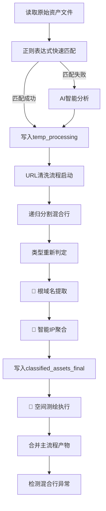

# 清羽 (ClearFeather)

## 攻防演练资产智能清洗与分类工具 v2.0

[](https://opensource.org/licenses/MIT)
[](https://www.python.org/downloads/)
[](https://platform.openai.com/docs/api-reference)
[](https://flask.palletsprojects.com/)
[](https://fofa.info/)

## 📖 目录

- [项目简介](#-项目简介)
- [功能特点](#-功能特点)
- [v2.0新增功能](#-v20新增功能)
- [Web界面](#-web界面)
- [安全特性](#-安全特性)
- [安装说明](#-安装说明)
- [配置说明](#-配置说明)
- [使用方法](#-使用方法)
- [输出文件说明](#-输出文件说明)
- [处理流程](#-处理流程)
- [资产分类规则](#-资产分类规则)
- [空间测绘功能](#-空间测绘功能)
- [最佳实践](#-最佳实践)
- [常见问题](#-常见问题)
- [贡献指南](#-贡献指南)
- [许可证](#-许可证)

## 🚀 项目简介

**清羽**是一款专为网络安全攻防演练设计的资产智能清洗与分类工具。它能够自动化处理攻防演练中的各类资产数据，包括IP、域名、URL等，通过结合AI大语言模型能力和精准的正则表达式处理，实现资产的高效识别、分类与整理。

### 🎯 核心优势

- **多格式输入**：支持混合分隔符、一行多资产、复杂格式
- **正则+AI混合识别**：优先正则快速处理，疑难行交给AI智能分析
- **自动分级**：URL自动分级（完整路径、一级路径、二级路径）
- **去重整合**：全局去重，避免重复资产
- **丰富输出**：按类型分类输出，满足不同场景需求
- **现代化Web界面**：直观的拖拽上传、实时进度监控、在线结果查看
- **企业级安全**：完整的安全验证、访问控制、日志记录
- **🌟 智能IP聚合**：三种策略智能聚合，大幅减少API调用
- **🌟 根域名提取**：自动提取根域名，优化空间测绘效率
- **🌟 空间测绘集成**：支持FOFA、Hunter等多引擎被动资产发现

## ✨ 功能特点

### 🔧 核心功能
- **多种文件格式支持**：支持TXT、CSV、Excel(.xlsx/.xls)等多种输入格式
- **多种资产类型支持**：IPv4/IPv6、域名、URL、IP:PORT、CIDR、IP段、应用账号等
- **智能混合处理**：结合正则表达式和AI分析，提高识别准确率
- **递归分割混合行**：彻底拆分一行多资产，支持所有常见分隔符（逗号、顿号、分号、空格等）
- **URL智能分级**：自动对URL进行分级处理，支持完整路径、一级路径和二级路径
- **去重与整合**：全局唯一去重，自动整合相关信息
- **格式自动修正**：自动修正常见格式错误（如 http:/1.2.3.4 → http://1.2.3.4）

### 🚀 技术特性
- **异步并发处理**：支持大批量资产高效处理
- **OpenAI兼容接口**：支持DeepSeek、GPT等多种AI服务
- **YAML配置化**：支持配置文件和命令行参数
- **主流程+清洗流程分离**：确保输出纯净，无混合行
- **详细日志记录**：完整的处理日志和异常记录

## 🌟 v2.0新增功能

### 🧠 智能IP聚合
- **三种聚合策略**：Conservative(保守)、Balanced(平衡)、Aggressive(激进)
- **智能分析**：IP类型识别、密度分析、分布检测、间隔分析
- **高效压缩**：最高可达84.3%的压缩率，大幅减少API调用
- **精准聚合**：避免过度聚合，确保目标资产精准度

#### 聚合策略对比
| 策略 | 压缩率 | 适用场景 | 特点 |
|------|--------|----------|------|
| Conservative | ~48% | 高精度渗透测试 | 避免误报，精准度最高 |
| Balanced ⭐ | ~57% | 一般攻防演练 | 效率精度平衡，推荐使用 |
| Aggressive | ~66% | 大规模资产发现 | 最大效率，发现影子资产 |

### 🌐 根域名提取
- **智能提取**：自动从完整域名中提取根域名
- **多级域名支持**：支持com.cn、co.uk等二级域名后缀
- **去重优化**：56.5%的去重率，减少重复查询
- **自动集成**：无缝集成到空间测绘流程

### 🔍 空间测绘功能
- **多引擎支持**：FOFA、Hunter等主流测绘引擎
- **智能查询生成**：自动生成最优查询语法
- **聚合IP查询**：支持C段网络、IP区间查询
- **结果自动合并**：测绘结果自动合并到主输出

#### 支持的查询类型
- **C段查询**：`ip="192.168.1.0/24"`
- **IP区间查询**：`ip>="192.168.1.1" && ip<="192.168.1.10"`
- **根域名查询**：`domain="example.com"`
- **证书查询**：`domain="example.com" || cert="example.com"`

## 🌐 Web界面

### 界面特性
- **现代化设计**：基于Bootstrap 5的响应式界面
- **拖拽上传**：支持文件拖拽上传，直观便捷
- **实时监控**：WebSocket实时进度更新，处理状态一目了然
- **在线查看**：支持多种文件格式在线预览（TXT、CSV、Excel、JSON）
- **批量下载**：一键下载所有结果文件的压缩包
- **任务管理**：完整的任务历史记录和状态管理
- **数据分析**：丰富的图表和统计信息展示

### 界面功能
- **文件上传页面**：拖拽上传、参数配置、实时验证
- **任务管理页面**：任务列表、进度监控、结果下载
- **数据分析页面**：资产统计、处理趋势、质量分析
- **系统设置页面**：配置管理、系统监控、日志查看

## 🔒 安全特性

### 文件上传安全
- **文件类型验证**：严格的文件扩展名和MIME类型检查
- **文件大小限制**：可配置的文件大小限制（默认100MB）
- **文件内容检测**：使用python-magic进行真实文件类型检测
- **文件名安全**：防止路径遍历、特殊字符过滤
- **安全文件名生成**：UUID+时间戳的安全命名策略

### 访问控制
- **CSRF保护**：完整的跨站请求伪造防护
- **频率限制**：基于IP的上传频率控制
- **会话管理**：安全的会话配置和超时控制
- **安全头部**：XSS保护、内容类型保护、点击劫持防护

### 安全监控
- **安全日志**：详细的安全事件记录和分析
- **威胁检测**：异常行为检测和自动阻断
- **配置管理**：动态安全配置和热重载
- **安全面板**：专门的安全管理和监控界面

## 📥 安装说明

### 依赖项

#### 核心依赖
- Python 3.7+
- aiohttp
- validators
- ipaddress
- PyYAML
- pandas (用于Excel/CSV文件支持)
- openpyxl (用于.xlsx文件支持)

#### Web界面依赖
- Flask
- Flask-SocketIO
- python-magic (用于文件类型检测)
- psutil (用于系统监控)

#### 空间测绘依赖
- requests
- base64 (内置)
- json (内置)

### 安装步骤

1. 克隆项目仓库

   ```bash
   git clone https://github.com/taielab/clearfeather.git
   cd clearfeather
   ```

2. 安装依赖包

   ```bash
   # 安装核心依赖
   pip install -r requirements.txt
   
   # 安装Web界面依赖
   pip install flask flask-socketio python-magic psutil
   
   # macOS用户可能需要安装libmagic
   brew install libmagic
   
   # Ubuntu/Debian用户
   sudo apt-get install libmagic1
   ```

## ⚙️ 配置说明

### 方式一：YAML配置文件（推荐）

创建 `config.yaml` 文件：

```yaml
# AI服务配置
API_KEY: "your-api-key-here"
API_ENDPOINT: "https://api.deepseek.com/v1/chat/completions"
DEEPSEEK_MODEL: "deepseek-chat"

# 文件路径配置
INPUT_FILE: "资产.txt"
TEMP_DIR: "temp_processing"
OUTPUT_DIR: "classified_assets_final"

# 性能配置
MAX_CONCURRENT_REQUESTS: 20
API_REQUEST_DELAY: 1.1

# 空间测绘配置
ENABLE_SPACE_MAPPING: true
SPACE_MAPPING_ENGINES: ["fofa", "hunter"]

# FOFA配置
FOFA_API_KEY: "your-fofa-api-key"
FOFA_EMAIL: "your-fofa-email@example.com"

# Hunter配置  
HUNTER_API_KEY: "your-hunter-api-key"

# 空间测绘参数
SPACE_MAPPING_MAX_RESULTS: 1000
SPACE_MAPPING_DELAY: 1.0
MERGE_MAPPING_RESULTS: true

# IP聚合策略配置
IP_AGGREGATION_STRATEGY: "balanced"  # conservative/balanced/aggressive

# Web界面配置
WEB_HOST: "127.0.0.1"
WEB_PORT: 5000
WEB_DEBUG: false
```

### 安全配置文件

创建 `security_config.yaml` 文件：

```yaml
# 文件上传安全配置
file_upload:
  max_file_size: 104857600  # 100MB
  allowed_extensions:
    - .txt
    - .csv
    - .xlsx
    - .xls
  max_filename_length: 255

# 访问控制配置
access_control:
  max_upload_rate: 10  # 每分钟最大上传次数
  session_timeout: 3600  # 会话超时时间（秒）
  enable_csrf_protection: true
  enable_rate_limiting: true

# 安全头部配置
security_headers:
  enable_csp: true
  enable_hsts: true
  enable_xss_protection: true
```

### 支持的AI服务

工具支持所有兼容OpenAI Chat API的服务：

- **DeepSeek**：`https://api.deepseek.com/v1/chat/completions`
- **OpenAI**：`https://api.openai.com/v1/chat/completions`
- **其他兼容服务**：如PPIO等，只需修改API_ENDPOINT即可

## 📋 使用方法

### Web界面使用（推荐）

1. 启动Web服务器

   ```bash
   # 方式一：直接启动
   python -m src.clearfeather.web_interface
   
   # 方式二：使用启动脚本
   python start_web_server.py
   
   # 方式三：自定义配置启动
   python start_web_server.py --host 0.0.0.0 --port 8080
   ```

2. 打开浏览器访问 `http://127.0.0.1:5000`

3. 使用Web界面功能：
   - **上传文件**：拖拽或点击上传资产文件
   - **配置参数**：设置AI密钥、处理参数等
   - **监控进度**：实时查看处理进度和状态
   - **查看结果**：在线预览或下载处理结果
   - **管理任务**：查看历史任务和统计信息

### 命令行使用

1. 准备包含资产列表的文件，支持多种格式：

   **TXT格式** (每行一个或多个资产):
   ```
   http://example.com/path,192.168.1.1
   www.test.com、10.0.0.1:8080
   domain.com;https://another.site/page
   ```

   **CSV格式** (支持多列数据):
   ```csv
   192.168.1.1,http://example.com,domain.com
   10.0.0.1:8080,https://test.com/path
   ```

   **Excel格式** (支持多个工作表，多列数据):
   - 支持.xlsx和.xls格式
   - 自动读取所有工作表
   - 将每行的所有非空列合并处理

2. 运行主程序

   ```bash
   python ClearFeather.py
   ```

3. 查看 `classified_assets_final` 目录中的结果文件

### 高级用法

```bash
# 使用自定义配置文件
python ClearFeather.py --config custom_config.yaml

# 处理不同格式的文件
python ClearFeather.py --input assets.csv        # CSV文件
python ClearFeather.py --input assets.xlsx       # Excel文件
python ClearFeather.py --input assets.txt        # 文本文件

# 启用空间测绘功能
python ClearFeather.py --enable-space-mapping

# 指定聚合策略
python ClearFeather.py --ip-aggregation-strategy conservative

# 处理大文件（调整并发数）
python ClearFeather.py --max-requests 10 --delay 2.0

# 仅使用正则，不调用AI（适合离线环境）
python ClearFeather.py --no-ai --input assets.xlsx

# 启动Web界面
python ClearFeather.py --web --host 0.0.0.0 --port 8080

# 完整参数示例
python ClearFeather.py \
  --input data/samples/资产.txt \
  --enable-space-mapping \
  --space-mapping-engines fofa,hunter \
  --ip-aggregation-strategy balanced \
  --fofa-api-key "your-fofa-key" \
  --fofa-email "your-email@example.com" \
  --hunter-api-key "your-hunter-key" \
  --debug
```

## 📊 输出文件说明

### 主要输出目录结构

```
classified_assets_final/
├── 网络地址类资产
│   ├── ips_ipv4.txt              # IPv4地址
│   ├── ips_aggregated.txt        # 🌟 聚合IP文件（新增）
│   ├── ips_ipv6.txt              # IPv6地址
│   ├── ip_ports.txt              # IP:端口组合
│   ├── cidrs_ipv4.txt            # IPv4网段
│   ├── cidrs_ipv6.txt            # IPv6网段
│   └── ip_ranges_ipv4.txt        # IPv4地址段
├── 网站和域名类资产
│   ├── domains.txt               # 完整域名
│   ├── root_domains.txt          # 🌟 根域名文件（新增）
│   ├── urls_clean_with_path.txt  # 完整URL（主要）
│   ├── urls_scheme_netloc.txt    # 协议+域名
│   ├── urls_with_level1_path.txt # 一级路径URL
│   └── urls_with_level2_path.txt # 二级路径URL
├── 空间测绘结果
│   └── space_mapping_results.json # 🌟 测绘结果（新增）
├── 其他资产类型
│   ├── app_names.txt             # 应用和账户名
│   └── others.txt                # 其他标识符
└── 日志和调查文件
    ├── cleanup_log.txt           # 清洗过程日志
    └── investigate_*.txt         # 需要人工检查的异常数据
```

### 新增文件说明

| 文件名 | 内容说明 | 示例 | 优势 |
|-------|---------|------|------|
| `ips_aggregated.txt` | 智能聚合的IP文件 | `192.168.1.0/24`<br>`10.0.0.1-10.0.0.5`<br>`8.8.8.8` | 84.3%压缩率，减少API调用 |
| `root_domains.txt` | 根域名文件 | `example.com`<br>`test.co.uk` | 56.5%去重率，优化查询 |
| `space_mapping_results.json` | 空间测绘结果 | 详细的资产信息和统计 | 被动资产发现，扩展攻击面 |

### 详细文件说明

| 文件名 | 内容说明 | 示例 |
|-------|---------|------|
| `ips_ipv4.txt` | 所有IPv4地址，一行一个 | `192.168.1.1` |
| `ip_ports.txt` | IP和端口组合 | `192.168.1.1:8080` |
| `urls_clean_with_path.txt` | **主要URL文件**，包含完整路径 | `http://example.com/path/file.php` |
| `urls_with_level1_path.txt` | 一级路径URL | `http://example.com/path` |
| `urls_with_level2_path.txt` | 二级路径URL | `http://example.com/path/subpath` |
| `domains.txt` | 完整域名，不含协议 | `sub.example.com` |
| `app_names.txt` | 应用账户名 | `微信号:test123` |

## ⚙️ 处理流程



### 三阶段处理架构

1. **主流程**：正则+AI识别，产物写入 `temp_processing` 目录
2. **清洗流程**：递归分割混合行，彻底拆分，产物写入 `classified_assets_final` 目录
3. **🌟 优化流程**：根域名提取、智能IP聚合、空间测绘执行
4. **合并阶段**：将主流程产物合并到最终输出，全局去重

## 📏 资产分类规则

### URL分级处理

| 分级类型 | 说明 | 输入示例 | 输出示例 |
|--------|------|---------|---------|
| 完整URL | 保留所有路径和参数 | `http://example.com/a/b/c.php?id=1` | `http://example.com/a/b/c.php?id=1` |
| 一级路径 | 只保留第一级路径 | 同上 | `http://example.com/a` |
| 二级路径 | 保留到第二级路径 | 同上 | `http://example.com/a/b` |

### 混合行处理策略

**输入示例**：
```
http://example.com/path,192.168.1.1、domain.com;https://test.com:8080
```

**处理结果**：
- `urls_clean_with_path.txt`：`http://example.com/path`、`https://test.com:8080`
- `ips_ipv4.txt`：`192.168.1.1`
- `domains.txt`：`domain.com`
- `ip_ports.txt`：`test.com:8080`（如果test.com被识别为IP）

### 格式自动修正

| 输入格式 | 修正后格式 | 说明 |
|---------|-----------|------|
| `http:/192.168.1.1` | `http://192.168.1.1` | 自动补全缺失的斜杠 |
| `https//example.com` | `https://example.com` | 自动补全缺失的冒号 |

## 🔍 空间测绘功能

### 功能概述
空间测绘功能能够自动从处理后的资产中提取目标，并使用FOFA、Hunter等测绘引擎进行被动资产发现，扩展攻防演练的资产范围。

### 支持的测绘引擎

#### 1. FOFA (fofa.info)
- **查询语法**：支持复杂的FOFA语法
- **字段返回**：ip, port, protocol, domain, title, country, city, server, banner, cert
- **限制**：根据账户等级限制查询数量
- **配置**：需要API Key和注册邮箱

#### 2. Hunter (hunter.qianxin.com)
- **查询语法**：支持Hunter专用语法
- **字段返回**：ip, port, protocol, domain, title, country, city, server, banner, url, status_code, company, isp
- **限制**：页大小限制(1,10,20,50,100)，有频率限制
- **配置**：需要API Key

### 智能查询生成

#### 目标文件优先级
1. `ips_aggregated.txt` - 🌟 聚合IP文件（优先）
2. `ips_ipv4.txt` - 完整IP文件（备用）
3. `root_domains.txt` - 🌟 根域名文件（优先）
4. `domains.txt` - 完整域名文件（备用）
5. `urls_scheme_netloc.txt` - URL文件

#### 查询语法示例
```python
# C段查询
ip="192.168.1.0/24"

# IP区间查询
ip>="192.168.1.1" && ip<="192.168.1.10"

# 根域名查询
domain="example.com"
domain="example.com" || cert="example.com"

# 关键词查询
title="keyword" || body="keyword" || header="keyword"
```

### 配置示例

```yaml
# 启用空间测绘
ENABLE_SPACE_MAPPING: true

# 指定测绘引擎
SPACE_MAPPING_ENGINES: ["fofa", "hunter"]

# FOFA配置
FOFA_API_KEY: "your_fofa_api_key"
FOFA_EMAIL: "your_fofa_email@example.com"

# Hunter配置  
HUNTER_API_KEY: "your_hunter_api_key"

# 测绘参数
SPACE_MAPPING_MAX_RESULTS: 1000
SPACE_MAPPING_DELAY: 1.0
MERGE_MAPPING_RESULTS: true
```

### 使用示例

```bash
# 启用空间测绘
python ClearFeather.py --enable-space-mapping

# 指定引擎和参数
python ClearFeather.py \
  --enable-space-mapping \
  --space-mapping-engines fofa,hunter \
  --space-mapping-max-results 500 \
  --fofa-api-key "your_key" \
  --fofa-email "your_email" \
  --hunter-api-key "your_key"
```

## 💡 最佳实践

### Web界面使用建议

1. **文件准备**：
   - 确保文件格式正确（TXT、CSV、Excel）
   - 文件大小不超过100MB（可在配置中调整）
   - 使用UTF-8编码避免中文乱码

2. **参数配置**：
   - 大文件处理时降低并发数（5-10）
   - 网络不稳定时增加延迟（2-3秒）
   - 离线环境可启用"无AI模式"

3. **安全建议**：
   - 定期更新API密钥
   - 监控安全日志
   - 及时清理临时文件

### IP聚合策略选择

#### 场景建议
- **红队渗透**：使用`conservative`策略，避免触发过多告警
- **蓝队防守**：使用`balanced`策略，全面了解资产暴露面
- **资产普查**：使用`aggressive`策略，最大化发现潜在资产

#### 配置示例
```yaml
# 保守策略 - 高精度
IP_AGGREGATION_STRATEGY: "conservative"

# 平衡策略 - 推荐
IP_AGGREGATION_STRATEGY: "balanced"

# 激进策略 - 最大效率
IP_AGGREGATION_STRATEGY: "aggressive"
```

### 空间测绘使用建议

1. **API成本控制**：
   - 设置合理的 `SPACE_MAPPING_MAX_TARGETS` 避免过多API调用
   - 设置合理的 `SPACE_MAPPING_MAX_RESULTS` 控制单次查询结果数

2. **网络环境**：
   - 确保网络能够访问测绘引擎的API
   - 某些环境可能需要配置代理

3. **合规使用**：
   - 遵守各测绘平台的使用条款
   - 仅用于授权的安全测试和研究

### 输入文件准备

1. **支持的分隔符**：逗号(,)、顿号(、)、分号(;)、全角分号(；)、空格、Tab
2. **混合格式示例**：
   ```
   http://site1.com,192.168.1.1、domain.com
   https://site2.com:8080;10.0.0.1
   app账号:test123 http://app.com/login
   ```

### 性能优化建议

1. **大文件处理**：降低 `MAX_CONCURRENT_REQUESTS` 到 5-10
2. **API限流**：增加 `API_REQUEST_DELAY` 到 2-3 秒
3. **网络不稳定**：启用重试机制（工具内置）

### 结果文件使用

```bash
# 主要资产扫描（使用聚合IP）
nmap -iL classified_assets_final/ips_aggregated.txt -oA aggregated_scan
nmap -iL classified_assets_final/ips_ipv4.txt -oA ip_scan
nmap -iL classified_assets_final/urls_clean_with_path.txt -oA url_scan

# 域名解析检查（使用根域名）
cat classified_assets_final/root_domains.txt | xargs -I {} dig {}
cat classified_assets_final/domains.txt | xargs -I {} dig {}

# 端口服务识别
nmap -iL classified_assets_final/ip_ports.txt -sV -oA port_scan

# 空间测绘结果分析
cat classified_assets_final/space_mapping_results.json | jq '.assets[] | .ip' | sort -u
```

## ❓ 常见问题

### Q: Web界面无法启动怎么办？

A: 
1. 检查是否安装了Flask相关依赖：`pip install flask flask-socketio`
2. 检查端口是否被占用：`lsof -i :5000`
3. 查看错误日志确定具体问题
4. 尝试更换端口：`python start_web_server.py --port 8080`

### Q: 文件上传失败怎么办？

A:
1. 检查文件格式是否支持（TXT、CSV、Excel）
2. 确认文件大小不超过限制（默认100MB）
3. 检查文件名是否包含特殊字符
4. 查看浏览器控制台错误信息

### Q: 为什么有些文件是空的？

A: 如果输入数据中没有对应类型的资产，相关文件会是空的。这是正常现象，不是bug。

### Q: AI API调用失败怎么办？

A: 
1. 检查API密钥是否正确
2. 确认API服务是否可用
3. 查看 `investigate_failed_api.txt` 了解失败详情
4. 调整 `API_REQUEST_DELAY` 避免限流

### Q: 如何处理超大文件？

A: 
1. 降低并发数：`MAX_CONCURRENT_REQUESTS: 5`
2. 增加延迟：`API_REQUEST_DELAY: 2.0`
3. 分批处理：将大文件拆分成多个小文件
4. 使用命令行模式处理大文件

### Q: 支持哪些AI服务？

A: 支持所有兼容OpenAI Chat API的服务，包括：
- DeepSeek
- OpenAI GPT
- Claude (通过兼容接口)
- 本地部署的开源模型
- 其他第三方兼容服务

### Q: 如何确保数据安全？

A:
1. 所有上传文件都在本地处理，不会上传到第三方
2. 启用了完整的安全验证和访问控制
3. 支持离线模式（--no-ai）完全本地处理
4. 定期清理临时文件和日志

### Q: 空间测绘功能相关问题

#### Q: 未找到可用的测绘目标？
A: 
- 确保主处理流程已完成，生成了目标文件
- 检查目标文件是否存在且不为空
- 启用调试模式查看详细路径信息

#### Q: API认证失败？
A:
- 检查API密钥是否正确
- 检查FOFA邮箱是否匹配
- 确认账户状态正常

#### Q: 频率限制？
A:
- 增加 `SPACE_MAPPING_DELAY` 参数
- 减少并发查询数量
- 分批次执行

### Q: IP聚合相关问题

#### Q: 聚合结果不理想？
A:
- 尝试不同的聚合策略（conservative/balanced/aggressive）
- 检查原始IP的分布特征
- 查看聚合日志了解详细过程

#### Q: 如何选择聚合策略？
A:
- **Conservative**: 高精度要求，避免误报
- **Balanced**: 一般场景，推荐使用
- **Aggressive**: 大规模发现，优先效率

## 👥 贡献指南

欢迎贡献代码、报告问题或提出改进建议！请遵循以下步骤：

1. Fork 本仓库
2. 创建您的特性分支 (`git checkout -b feature/amazing-feature`)
3. 提交您的更改 (`git commit -m 'Add some amazing feature'`)
4. 推送到分支 (`git push origin feature/amazing-feature`)
5. 开启一个 Pull Request

## 📜 许可证

本项目采用 MIT 许可证 - 详情请查看 [LICENSE](LICENSE) 文件

---

## 🔥 AI安全工坊

**由 AI安全工坊 开发**  
**微信公众号搜索关注：AI安全工坊**

### AI安全工坊内部社群 · 6大核心价值

1. **AI安全实战**→ AI渗透测试 | 模型加固 | 数据防护 | 模型测评
2. **开发全栈指南**→ 大模型应用 | Agent开发 | 行业解决方案 | AI安全工具 | AI产品开发
3. **商业落地加速**→ 案例拆解 | ROI优化 | 合规指南
4. **专属学习支持**→ 文档库 | 答疑 | 代码示例 | 1v1 解答
5. **独家资源网络**→ 工具包 | 漏洞库 | 行业报告 | AI视频课程 | AI多模态资源
6. **高质量AI社群**→ 技术交流 | 内推机会 | 项目合作


### AI安全工坊-AISecKit安全工具资源平台

**网站地址：https://aiseckit.com/** 

***网站介绍：AISecKit 提供了一个专注于 AI 安全工具和大型语言模型安全资源的平台，为专注于 AI 安全和网络安全专业人士提供了一系列的工具和资源。***


 
