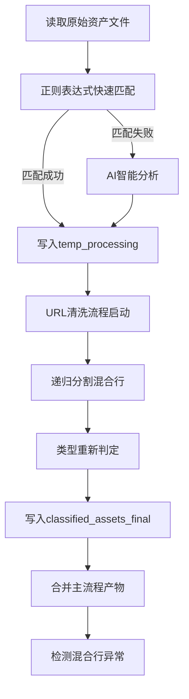

# 清羽 (ClearFeather)

## 攻防演练资产智能清洗与分类工具

[](https://opensource.org/licenses/MIT)
[](https://www.python.org/downloads/)
[](https://platform.openai.com/docs/api-reference)

## 📖 目录

- [项目简介](#-项目简介)
- [功能特点](#-功能特点)
- [安装说明](#-安装说明)
- [配置说明](#-配置说明)
- [使用方法](#-使用方法)
- [输出文件说明](#-输出文件说明)
- [处理流程](#-处理流程)
- [资产分类规则](#-资产分类规则)
- [最佳实践](#-最佳实践)
- [常见问题](#-常见问题)
- [贡献指南](#-贡献指南)
- [许可证](#-许可证)

## 🚀 项目简介

**清羽**是一款专为网络安全攻防演练设计的资产智能清洗与分类工具。它能够自动化处理攻防演练中的各类资产数据，包括IP、域名、URL等，通过结合AI大语言模型能力和精准的正则表达式处理，实现资产的高效识别、分类与整理。

### 🎯 核心优势

- **多格式输入**：支持混合分隔符、一行多资产、复杂格式
- **正则+AI混合识别**：优先正则快速处理，疑难行交给AI智能分析
- **自动分级**：URL自动分级（完整路径、一级路径、二级路径）
- **去重整合**：全局去重，避免重复资产
- **丰富输出**：按类型分类输出，满足不同场景需求

## ✨ 功能特点

### 🔧 核心功能
- **多种资产类型支持**：IPv4/IPv6、域名、URL、IP:PORT、CIDR、IP段、应用账号等
- **智能混合处理**：结合正则表达式和AI分析，提高识别准确率
- **递归分割混合行**：彻底拆分一行多资产，支持所有常见分隔符（逗号、顿号、分号、空格等）
- **URL智能分级**：自动对URL进行分级处理，支持完整路径、一级路径和二级路径
- **去重与整合**：全局唯一去重，自动整合相关信息
- **格式自动修正**：自动修正常见格式错误（如 http:/1.2.3.4 → http://1.2.3.4）

### 🚀 技术特性
- **异步并发处理**：支持大批量资产高效处理
- **OpenAI兼容接口**：支持DeepSeek、GPT等多种AI服务
- **YAML配置化**：支持配置文件和命令行参数
- **主流程+清洗流程分离**：确保输出纯净，无混合行
- **详细日志记录**：完整的处理日志和异常记录

## 📥 安装说明

### 依赖项

- Python 3.7+
- aiohttp
- validators
- ipaddress
- PyYAML

### 安装步骤

1. 克隆项目仓库

   ```bash
   git clone https://github.com/taielab/clearfeather.git
   cd clearfeather
   ```

2. 安装依赖包

   ```bash
   pip install -r requirements.txt
   ```

## ⚙️ 配置说明

### 方式一：YAML配置文件（推荐）

创建 `config.yaml` 文件：

```yaml
# AI服务配置
API_KEY: "your-api-key-here"
API_ENDPOINT: "https://api.deepseek.com/v1/chat/completions"
DEEPSEEK_MODEL: "deepseek-chat"

# 文件路径配置
INPUT_FILE: "资产.txt"
TEMP_DIR: "temp_processing"
OUTPUT_DIR: "classified_assets_final"

# 性能配置
MAX_CONCURRENT_REQUESTS: 20
API_REQUEST_DELAY: 1.1
```

### 方式二：直接修改代码

在 `ClearFeather.py` 文件中修改配置：

```python
API_KEY = "your-api-key-here"
INPUT_FILE = "资产.txt"
OUTPUT_DIR = "classified_assets_final"
```

### 支持的AI服务

工具支持所有兼容OpenAI Chat API的服务：

- **DeepSeek**：`https://api.deepseek.com/v1/chat/completions`
- **OpenAI**：`https://api.openai.com/v1/chat/completions`
- **其他兼容服务**：如PPIO等，只需修改API_ENDPOINT即可

## 📋 使用方法

### 基本用法

1. 准备包含资产列表的文本文件，每行一个或多个资产

   ```
   http://example.com/path,192.168.1.1
   www.test.com、10.0.0.1:8080
   domain.com;https://another.site/page
   ```

2. 运行主程序

   ```bash
   python ClearFeather.py
   ```

3. 查看 `classified_assets_final` 目录中的结果文件

### 高级用法

```bash
# 使用自定义配置文件
python ClearFeather.py --config custom_config.yaml

# 处理大文件（调整并发数）
# 在config.yaml中设置：MAX_CONCURRENT_REQUESTS: 10
```

## 📊 输出文件说明

### 主要输出目录结构

```
classified_assets_final/
├── 网络地址类资产
│   ├── ips_ipv4.txt              # IPv4地址
│   ├── ips_ipv6.txt              # IPv6地址
│   ├── ip_ports.txt              # IP:端口组合
│   ├── cidrs_ipv4.txt            # IPv4网段
│   ├── cidrs_ipv6.txt            # IPv6网段
│   └── ip_ranges_ipv4.txt        # IPv4地址段
├── 网站和域名类资产
│   ├── domains.txt               # 纯域名
│   ├── urls_clean_with_path.txt  # 完整URL（主要）
│   ├── urls_scheme_netloc.txt    # 协议+域名
│   ├── urls_with_level1_path.txt # 一级路径URL
│   └── urls_with_level2_path.txt # 二级路径URL
├── 其他资产类型
│   ├── app_names.txt             # 应用和账户名
│   └── others.txt                # 其他标识符
└── 日志和调查文件
    ├── cleanup_log.txt           # 清洗过程日志
    └── investigate_*.txt         # 需要人工检查的异常数据
```

### 详细文件说明

| 文件名 | 内容说明 | 示例 |
|-------|---------|------|
| `ips_ipv4.txt` | 所有IPv4地址，一行一个 | `192.168.1.1` |
| `ip_ports.txt` | IP和端口组合 | `192.168.1.1:8080` |
| `urls_clean_with_path.txt` | **主要URL文件**，包含完整路径 | `http://example.com/path/file.php` |
| `urls_with_level1_path.txt` | 一级路径URL | `http://example.com/path` |
| `urls_with_level2_path.txt` | 二级路径URL | `http://example.com/path/subpath` |
| `domains.txt` | 纯域名，不含协议 | `example.com` |
| `app_names.txt` | 应用账户名 | `微信号:test123` |

## ⚙️ 处理流程



### 两阶段处理架构

1. **主流程**：正则+AI识别，产物写入 `temp_processing` 目录
2. **清洗流程**：递归分割混合行，彻底拆分，产物写入 `classified_assets_final` 目录
3. **合并阶段**：将主流程产物合并到最终输出，全局去重

## 📏 资产分类规则

### URL分级处理

| 分级类型 | 说明 | 输入示例 | 输出示例 |
|--------|------|---------|---------|
| 完整URL | 保留所有路径和参数 | `http://example.com/a/b/c.php?id=1` | `http://example.com/a/b/c.php?id=1` |
| 一级路径 | 只保留第一级路径 | 同上 | `http://example.com/a` |
| 二级路径 | 保留到第二级路径 | 同上 | `http://example.com/a/b` |

### 混合行处理策略

**输入示例**：
```
http://example.com/path,192.168.1.1、domain.com;https://test.com:8080
```

**处理结果**：
- `urls_clean_with_path.txt`：`http://example.com/path`、`https://test.com:8080`
- `ips_ipv4.txt`：`192.168.1.1`
- `domains.txt`：`domain.com`
- `ip_ports.txt`：`test.com:8080`（如果test.com被识别为IP）

### 格式自动修正

| 输入格式 | 修正后格式 | 说明 |
|---------|-----------|------|
| `http:/192.168.1.1` | `http://192.168.1.1` | 自动补全缺失的斜杠 |
| `https//example.com` | `https://example.com` | 自动补全缺失的冒号 |

## 💡 最佳实践

### 输入文件准备

1. **支持的分隔符**：逗号(,)、顿号(、)、分号(;)、全角分号(；)、空格、Tab
2. **混合格式示例**：
   ```
   http://site1.com,192.168.1.1、domain.com
   https://site2.com:8080;10.0.0.1
   app账号:test123 http://app.com/login
   ```

### 性能优化建议

1. **大文件处理**：降低 `MAX_CONCURRENT_REQUESTS` 到 5-10
2. **API限流**：增加 `API_REQUEST_DELAY` 到 2-3 秒
3. **网络不稳定**：启用重试机制（工具内置）

### 结果文件使用

```bash
# 主要资产扫描
nmap -iL classified_assets_final/ips_ipv4.txt -oA ip_scan
nmap -iL classified_assets_final/urls_clean_with_path.txt -oA url_scan

# 域名解析检查
cat classified_assets_final/domains.txt | xargs -I {} dig {}

# 端口服务识别
nmap -iL classified_assets_final/ip_ports.txt -sV -oA port_scan
```

## ❓ 常见问题

### Q: 为什么有些文件是空的？

A: 如果输入数据中没有对应类型的资产，相关文件会是空的。这是正常现象，不是bug。

### Q: AI API调用失败怎么办？

A: 
1. 检查API密钥是否正确
2. 确认API服务是否可用
3. 查看 `investigate_failed_api.txt` 了解失败详情
4. 调整 `API_REQUEST_DELAY` 避免限流

### Q: 如何处理超大文件？

A: 
1. 降低并发数：`MAX_CONCURRENT_REQUESTS: 5`
2. 增加延迟：`API_REQUEST_DELAY: 2.0`
3. 分批处理：将大文件拆分成多个小文件

### Q: 支持哪些AI服务？

A: 支持所有兼容OpenAI Chat API的服务，包括：
- DeepSeek
- OpenAI GPT
- Claude (通过兼容接口)
- 本地部署的开源模型
- 其他第三方兼容服务

## 👥 贡献指南

欢迎贡献代码、报告问题或提出改进建议！请遵循以下步骤：

1. Fork 本仓库
2. 创建您的特性分支 (`git checkout -b feature/amazing-feature`)
3. 提交您的更改 (`git commit -m 'Add some amazing feature'`)
4. 推送到分支 (`git push origin feature/amazing-feature`)
5. 开启一个 Pull Request

## 📜 许可证

本项目采用 MIT 许可证 - 详情请查看 [LICENSE](LICENSE) 文件

---

## 🔥 AI安全工坊

**由 AI安全工坊 开发**  
**微信公众号搜索关注：AI安全工坊**

### AI安全工坊内部社群 · 6大核心价值

1. **AI安全实战**→ AI渗透测试 | 模型加固 | 数据防护 | 模型测评
2. **开发全栈指南**→ 大模型应用 | Agent开发 | 行业解决方案 | AI安全工具 | AI产品开发
3. **商业落地加速**→ 案例拆解 | ROI优化 | 合规指南
4. **专属学习支持**→ 文档库 | 答疑 | 代码示例 | 1v1 解答
5. **独家资源网络**→ 工具包 | 漏洞库 | 行业报告 | AI视频课程 | AI多模态资源
6. **高质量AI社群**→ 技术交流 | 内推机会 | 项目合作


### AI安全工坊-AISecKit安全工具资源平台

**网站地址：https://aiseckit.com/** 

***网站介绍：AISecKit 提供了一个专注于 AI 安全工具和大型语言模型安全资源的平台，为专注于 AI 安全和网络安全专业人士提供了一系列的工具和资源。***


 
