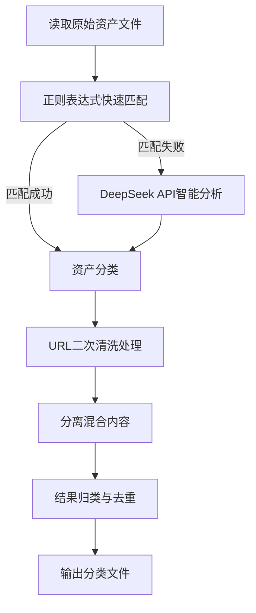

# 清羽 (ClearFeather)

## 攻防演练资产智能清洗与分类工具

[](https://opensource.org/licenses/MIT)
[](https://www.python.org/downloads/)
[](https://api.deepseek.com/)

## 📖 目录

- [项目简介](#-项目简介)
- [功能特点](#-功能特点)
- [安装说明](#-安装说明)
- [使用方法](#-使用方法)
- [输出文件说明](#-输出文件说明)
- [处理流程](#-处理流程)
- [资产分类规则](#-资产分类规则)
- [最佳实践](#-最佳实践)
- [常见问题](#-常见问题)
- [贡献指南](#-贡献指南)
- [许可证](#-许可证)

## 🚀 项目简介

**清羽**是一款专为网络安全攻防演练设计的资产智能清洗与分类工具。它能够自动化处理攻防演练中的各类资产数据，包括IP、域名、URL等，通过结合DeepSeek API的大语言模型能力和精准的正则表达式处理，实现资产的高效识别、分类与整理。

## ✨ 功能特点

- **多种资产类型支持**：自动识别并分类IP、域名、URL、端口等多种资产类型
- **智能混合处理**：结合正则表达式和AI分析，提高识别准确率
- **URL智能分级**：自动对URL进行分级处理，支持完整路径、一级路径和二级路径
- **去重与整合**：自动去除重复资产，整合相关信息
- **混合格式处理**：能处理一行包含多种资产的混合格式
- **丰富的结果输出**：提供多种分类结果文件，满足不同场景需求

## 📥 安装说明

### 依赖项

- Python 3.7+
- aiohttp
- validators
- ipaddress

### 安装步骤

1. 克隆项目仓库

   ```bash
   git clone https://github.com/taielab/clearfeather.git
   cd clearfeather
   ```

2. 安装依赖包

   ```bash
   pip install -r requirements.txt
   ```

3. 配置DeepSeek API密钥

在`clearfeather.py`文件中，替换以下内容：

```python
API_KEY = "你的DeepSeek API密钥" 
```

## 📋 使用方法

### 基本用法

1. 准备包含资产列表的文本文件，每行一个资产

2. 运行主程序

   ```bash
   python clearfeather.py
   ```

3. 查看`classified_assets_final`目录中的结果文件

### 配置选项

在脚本开头部分，您可以自定义以下配置：

```python
INPUT_FILE = "资产.txt"  # 输入文件名
OUTPUT_DIR = "classified_assets_final"  # 输出目录名
MAX_CONCURRENT_REQUESTS = 20  # 最大并发请求数
API_REQUEST_DELAY = 1.1  # API请求延迟
```

## 📊 输出文件说明

所有处理后的资产将保存在`classified_assets_final`目录中，包含以下文件：

### 网络地址类资产

| 文件名 | 内容说明 |
|-------|--------|
| `ips_ipv4.txt` | 所有识别出的IPv4地址，每行一个，格式如：`192.168.1.1` |
| `ips_ipv6.txt` | 所有识别出的IPv6地址，每行一个 |
| `ip_ports.txt` | IP地址与端口的组合，格式如：`192.168.1.1:8080` |
| `cidrs_ipv4.txt` | IPv4 CIDR格式的网段，如：`192.168.1.0/24` |
| `cidrs_ipv6.txt` | IPv6 CIDR格式的网段 |
| `ip_ranges_ipv4.txt` | IPv4地址范围，如：`192.168.1.1-192.168.1.10` |
| `all_expanded_ips.txt` | 所有从CIDR和IP范围展开的单个IP地址 |

### 网站和域名类资产

| 文件名 | 内容说明 |
|-------|--------|
| `domains.txt` | 所有识别出的域名，每行一个，不包含协议和路径 |
| `urls_clean_with_path.txt` | 完整URL，包含协议、域名和完整路径 |
| `urls_scheme_netloc.txt` | URL的基础部分，仅包含协议和域名（不含路径） |
| `urls_with_level1_path.txt` | URL包含一级路径，如：`http://example.com/path1` |
| `urls_with_level2_path.txt` | URL包含二级路径，如：`http://example.com/path1/path2` |

### 其他资产类型

| 文件名 | 内容说明 |
|-------|--------|
| `app_names.txt` | 应用程序和账户名称 |
| `others.txt` | 未能归类到以上类别的其他标识符 |

### 日志和调查文件

| 文件名 | 内容说明 |
|-------|--------|
| `cleanup_log.txt` | URL清洗过程的日志记录 |
| `log_ai_processed.txt` | AI处理过程的日志记录 |
| `log_regex_processed.txt` | 正则表达式处理的日志记录 |
| `investigate_failed_api.txt` | API调用失败的记录，需要人工检查 |
| `investigate_malformed.txt` | 格式不正确的资产记录，需要人工检查 |
| `investigate_other.txt` | 其他需要调查的记录 |

## ⚙️ 处理流程



1. **初始处理**：脚本首先读取原始资产文件，使用正则表达式进行快速匹配
2. **AI分析**：对于无法通过正则表达式识别的资产，调用DeepSeek API进行智能分析
3. **URL清洗**：对分类后的URL进行二次处理，分离混合内容（如URL和IP混在一行）
4. **结果归类**：将所有资产按照类型分别保存到对应的文件中

## 📏 资产分类规则

### URL分级处理

| 分级类型 | 说明 | 示例 |
|--------|------|------|
| 完整URL | 包含协议、域名和完整路径 | `http://example.com/path1/path2/file.php` |
| 一级路径URL | 只保留第一级路径 | `http://example.com/path1` |
| 二级路径URL | 保留到第二级路径 | `http://example.com/path1/path2` |

### IP与端口处理策略

- 当URL中包含IP和端口时，会同时保存到URL和IP:PORT分类中
- 例如：`http://192.168.1.1:8080/path` 会在URL文件中保存完整路径，同时在IP:PORT文件中保存`192.168.1.1:8080`

### 混合内容处理

- 对于包含多种资产的行（如同时包含URL和IP），会智能分离并分别保存
- 例如：`http://example.com/path,192.168.1.1` 会被分离成URL和IP两个独立资产

## 💡 最佳实践

### 资产管理建议

1. 优先使用`urls_clean_with_path.txt`、`domains.txt`和`ips_ipv4.txt`等主要分类文件进行资产管理
2. 对于需要精确控制的场景，可以使用不同级别的URL路径文件
3. 对于发现的异常数据，请查看`investigate_`开头的文件进行人工核查

### 高效工作流

```bash
# 处理资产清单
python clearfeather.py

# 扫描结果分析示例 (使用您喜欢的工具)
nmap -iL classified_assets_final/ips_ipv4.txt -oA scan_results
```

## ❓ 常见问题

### Q: 为什么某些URL没有被正确分离？

A: 部分复杂格式可能超出了当前规则的处理能力，请查看`investigate_`开头的文件进行人工判断。

### Q: 工具处理大量资产的性能如何？

A: 工具采用异步处理和并发请求，可高效处理大量资产。可通过调整`MAX_CONCURRENT_REQUESTS`参数优化性能。

### Q: DeepSeek API调用失败怎么办？

A: 请检查API密钥是否正确，以及是否达到API使用限制。失败的处理会记录在`investigate_failed_api.txt`中。

## 👥 贡献指南

欢迎贡献代码、报告问题或提出改进建议！请遵循以下步骤：

1. Fork 本仓库
2. 创建您的特性分支 (`git checkout -b feature/amazing-feature`)
3. 提交您的更改 (`git commit -m 'Add some amazing feature'`)
4. 推送到分支 (`git push origin feature/amazing-feature`)
5. 开启一个 Pull Request

## 📜 许可证

本项目采用 MIT 许可证 - 详情请查看 [LICENSE](LICENSE) 文件

## AI安全工坊内部社群

**🔥 AI安全工坊社群 · 6大核心价值 🔥**

1. **AI安全实战**→ AI渗透测试 | 模型加固 | 数据防护 | 模型测评
2. **开发全栈指南**→ 大模型应用 | Agent开发 | 行业解决方案 | AI安全工具 | AI产品开发
3. **商业落地加速**→ 案例拆解 | ROI优化 | 合规指南
4. **专属学习支持**→ 文档库 | 答疑 | 代码示例 | 1v1 解答
5. **独家资源网络**→ 工具包 | 漏洞库 | 行业报告 | AI视频课程 | AI多模态资源
6. **高质量AI社群**→ 技术交流 | 内推机会 | 项目合作


## AI安全工坊-AISecKit安全工具资源平台

**网站地址：https://aiseckit.com/** 

***网站介绍：AISecKit 提供了一个专注于 AI 安全工具和大型语言模型安全资源的平台，为专注于 AI 安全和网络安全专业人士提供了一系列的工具和资源。***


 
