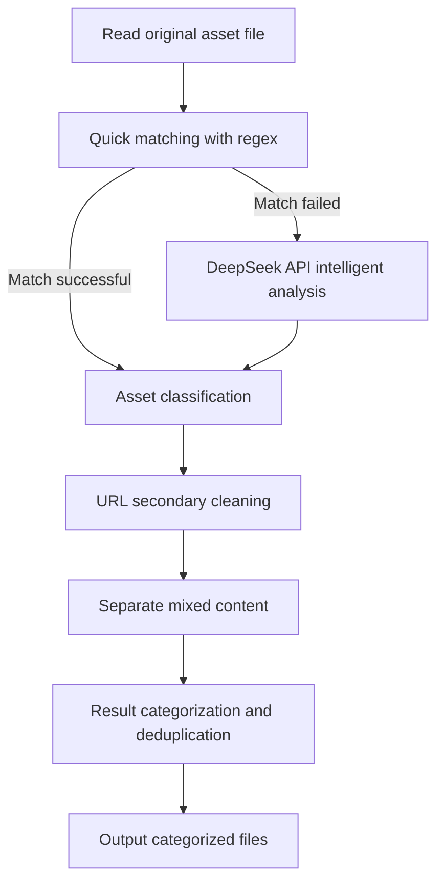

# ClearFeather

## Asset Intelligent Cleansing and Classification Tool for Security Exercises

[](https://opensource.org/licenses/MIT)
[](https://www.python.org/downloads/)
[](https://api.deepseek.com/)

## 📖 Table of Contents

- [Introduction](#-introduction)
- [Features](#-features)
- [Installation](#-installation)
- [Usage](#-usage)
- [Output Files](#-output-files)
- [Processing Flow](#-processing-flow)
- [Asset Classification Rules](#-asset-classification-rules)
- [Best Practices](#-best-practices)
- [FAQ](#-faq)
- [Contributing](#-contributing)
- [License](#-license)

## 🚀 Introduction

**ClearFeather** is an intelligent asset cleansing and classification tool designed specifically for network security exercises. It automates the processing of various asset data in security exercises, including IPs, domains, URLs, and more. By combining the capabilities of DeepSeek API's large language model and precise regular expression processing, it achieves efficient identification, classification, and organization of assets.

## ✨ Features

- **Multiple Asset Type Support**: Automatically identifies and classifies IPs, domains, URLs, ports, and more
- **Intelligent Hybrid Processing**: Combines regular expressions and AI analysis to improve recognition accuracy
- **URL Smart Leveling**: Automatically processes URLs into levels, supporting full paths, first-level paths, and second-level paths
- **Deduplication & Integration**: Automatically removes duplicate assets and integrates related information
- **Mixed Format Handling**: Processes lines containing multiple types of assets
- **Rich Output Results**: Provides multiple categorized result files to meet different scenario needs

## 📥 Installation

### Dependencies

- Python 3.7+
- aiohttp
- validators
- ipaddress

### Installation Steps

1. Clone the repository

   ```bash
   git clone https://github.com/taielab/clearfeather.git
   cd clearfeather
   ```

2. Install dependencies

   ```bash
   pip install -r requirements.txt
   ```

3. Configure DeepSeek API Key

   In the `clearfeather.py` file, replace the following:

   ```python
   API_KEY = "YOUR_DEEPSEEK_API_KEY" 
   ```

## 📋 Usage

### Basic Usage

1. Prepare a text file containing a list of assets, one per line

2. Run the main program

   ```bash
   python clearfeather.py
   ```

3. View the result files in the `classified_assets_final` directory

### Configuration Options

In the beginning part of the script, you can customize the following configurations:

```python
INPUT_FILE = "assets.txt"  # Input filename
OUTPUT_DIR = "classified_assets_final"  # Output directory name
MAX_CONCURRENT_REQUESTS = 20  # Maximum concurrent requests
API_REQUEST_DELAY = 1.1  # API request delay
```

## 📊 Output Files

All processed assets will be saved in the `classified_assets_final` directory, including the following files:

### Network Address Assets

| Filename | Description |
|-------|--------|
| `ips_ipv4.txt` | All identified IPv4 addresses, one per line, format: `192.168.1.1` |
| `ips_ipv6.txt` | All identified IPv6 addresses, one per line |
| `ip_ports.txt` | Combinations of IP addresses and ports, format: `192.168.1.1:8080` |
| `cidrs_ipv4.txt` | IPv4 CIDR format network segments, e.g., `192.168.1.0/24` |
| `cidrs_ipv6.txt` | IPv6 CIDR format network segments |
| `ip_ranges_ipv4.txt` | IPv4 address ranges, e.g., `192.168.1.1-192.168.1.10` |
| `all_expanded_ips.txt` | All individual IP addresses expanded from CIDRs and IP ranges |

### Website and Domain Assets

| Filename | Description |
|-------|--------|
| `domains.txt` | All identified domains, one per line, without protocol or path |
| `urls_clean_with_path.txt` | Complete URLs, including protocol, domain, and full path |
| `urls_scheme_netloc.txt` | Base part of URLs, only including protocol and domain (without path) |
| `urls_with_level1_path.txt` | URLs including first-level paths, e.g., `http://example.com/path1` |
| `urls_with_level2_path.txt` | URLs including second-level paths, e.g., `http://example.com/path1/path2` |

### Other Asset Types

| Filename | Description |
|-------|--------|
| `app_names.txt` | Application and account names |
| `others.txt` | Other identifiers that couldn't be classified into the above categories |

### Logs and Investigation Files

| Filename | Description |
|-------|--------|
| `cleanup_log.txt` | Log records of the URL cleaning process |
| `log_ai_processed.txt` | Log records of the AI processing |
| `log_regex_processed.txt` | Log records of regex processing |
| `investigate_failed_api.txt` | Records of API call failures, requiring manual checks |
| `investigate_malformed.txt` | Records of malformed assets, requiring manual checks |
| `investigate_other.txt` | Other records that need investigation |

## ⚙️ Processing Flow



1. **Initial Processing**: The script first reads the original asset file and performs quick matching using regular expressions
2. **AI Analysis**: For assets that cannot be identified through regular expressions, the DeepSeek API is called for intelligent analysis
3. **URL Cleaning**: Perform secondary processing on the classified URLs, separating mixed content (e.g., URLs and IPs mixed in one line)
4. **Result Classification**: All assets are saved to the corresponding files according to their types

## 📏 Asset Classification Rules

### URL Level Processing

| Level Type | Description | Example |
|--------|------|------|
| Complete URL | Including protocol, domain, and full path | `http://example.com/path1/path2/file.php` |
| First-level path URL | Only retaining the first-level path | `http://example.com/path1` |
| Second-level path URL | Retaining up to the second-level path | `http://example.com/path1/path2` |

### IP and Port Processing Strategy

- When a URL contains an IP and port, they will be saved both to the URL and IP:PORT classifications
- For example: `http://192.168.1.1:8080/path` will be saved with the full path in the URL file, and simultaneously `192.168.1.1:8080` will be saved in the IP:PORT file

### Mixed Content Processing

- For lines containing multiple types of assets (such as URLs and IPs), they will be intelligently separated and saved separately
- For example: `http://example.com/path,192.168.1.1` will be separated into a URL and an IP as two independent assets

## 💡 Best Practices

### Asset Management Suggestions

1. Primarily use `urls_clean_with_path.txt`, `domains.txt`, and `ips_ipv4.txt` for asset management
2. For scenarios requiring precise control, use different level URL path files
3. For anomalous data discovered, check files starting with `investigate_` for manual verification

### Efficient Workflow

```bash
# Process asset inventory
python clearfeather.py

# Scan result analysis example (using your preferred tool)
nmap -iL classified_assets_final/ips_ipv4.txt -oA scan_results
```

## ❓ FAQ

### Q: Why are some URLs not correctly separated?

A: Some complex formats may exceed the processing capabilities of the current rules. Please check files starting with `investigate_` for manual judgment.

### Q: How does the tool perform when processing large amounts of assets?

A: The tool uses asynchronous processing and concurrent requests, efficiently handling large volumes of assets. Performance can be optimized by adjusting the `MAX_CONCURRENT_REQUESTS` parameter.

### Q: What if DeepSeek API calls fail?

A: Please check if your API key is correct and whether you've reached API usage limits. Failed processing will be recorded in `investigate_failed_api.txt`.

## 👥 Contributing

Contributions of code, issue reports, or improvement suggestions are welcome! Please follow these steps:

1. Fork this repository
2. Create your feature branch (`git checkout -b feature/amazing-feature`)
3. Commit your changes (`git commit -m 'Add some amazing feature'`)
4. Push to the branch (`git push origin feature/amazing-feature`)
5. Open a Pull Request

## 📜 License

This project is licensed under the MIT License - see the [LICENSE](LICENSE) file for details
