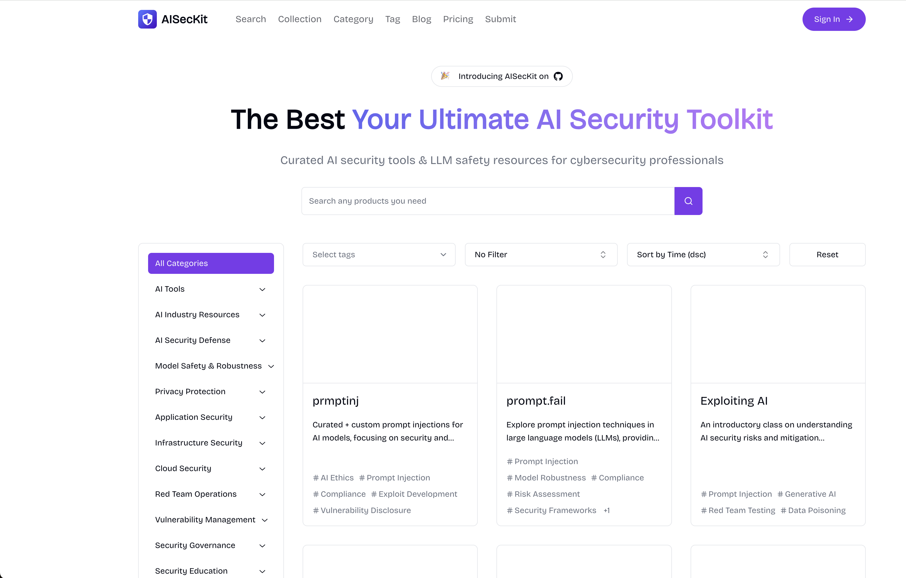

# ClearFeather

## Asset Intelligent Cleansing and Classification Tool for Security Exercises

[](https://opensource.org/licenses/MIT)
[](https://www.python.org/downloads/)
[](https://platform.openai.com/docs/api-reference)

## 📖 Table of Contents

- [Introduction](#-introduction)
- [Features](#-features)
- [Installation](#-installation)
- [Configuration](#-configuration)
- [Usage](#-usage)
- [Output Files](#-output-files)
- [Processing Flow](#-processing-flow)
- [Asset Classification Rules](#-asset-classification-rules)
- [Best Practices](#-best-practices)
- [FAQ](#-faq)
- [Contributing](#-contributing)
- [License](#-license)

## 🚀 Introduction

**ClearFeather** is an intelligent asset cleansing and classification tool designed specifically for network security exercises. It automates the processing of various asset data in security exercises, including IPs, domains, URLs, and more. By combining the capabilities of AI large language models and precise regular expression processing, it achieves efficient identification, classification, and organization of assets.

### 🎯 Core Advantages

- **Multi-format Input**: Supports mixed separators, multiple assets per line, complex formats
- **Regex+AI Hybrid Recognition**: Prioritizes regex for fast processing, delegates difficult lines to AI intelligent analysis
- **Automatic Leveling**: URL automatic leveling (full path, first-level path, second-level path)
- **Deduplication & Integration**: Global deduplication, avoiding duplicate assets
- **Rich Output**: Categorized output by type, meeting different scenario needs

## ✨ Features

### 🔧 Core Functions
- **Multiple Asset Type Support**: IPv4/IPv6, domains, URLs, IP:PORT, CIDR, IP ranges, application accounts, etc.
- **Intelligent Hybrid Processing**: Combines regular expressions and AI analysis to improve recognition accuracy
- **Recursive Mixed Line Splitting**: Thoroughly splits multi-asset lines, supports all common separators (commas, ideographic commas, semicolons, spaces, etc.)
- **URL Smart Leveling**: Automatically processes URLs into levels, supporting full paths, first-level paths, and second-level paths
- **Deduplication & Integration**: Global unique deduplication, automatic integration of related information
- **Automatic Format Correction**: Automatically corrects common format errors (e.g., http:/1.2.3.4 → http://1.2.3.4)

### 🚀 Technical Features
- **Asynchronous Concurrent Processing**: Supports efficient processing of large batches of assets
- **OpenAI Compatible Interface**: Supports DeepSeek, GPT, and other AI services
- **YAML Configuration**: Supports configuration files and command-line parameters
- **Main Process + Cleaning Process Separation**: Ensures clean output with no mixed lines
- **Detailed Logging**: Complete processing logs and exception records

## 📥 Installation

### Dependencies

- Python 3.7+
- aiohttp
- validators
- ipaddress
- PyYAML

### Installation Steps

1. Clone the repository

   ```bash
   git clone https://github.com/taielab/clearfeather.git
   cd clearfeather
   ```

2. Install dependencies

   ```bash
   pip install -r requirements.txt
   ```

## ⚙️ Configuration

### Method 1: YAML Configuration File (Recommended)

Create a `config.yaml` file:

```yaml
# AI Service Configuration
API_KEY: "your-api-key-here"
API_ENDPOINT: "https://api.deepseek.com/v1/chat/completions"
DEEPSEEK_MODEL: "deepseek-chat"

# File Path Configuration
INPUT_FILE: "assets.txt"
TEMP_DIR: "temp_processing"
OUTPUT_DIR: "classified_assets_final"

# Performance Configuration
MAX_CONCURRENT_REQUESTS: 20
API_REQUEST_DELAY: 1.1
```

### Method 2: Direct Code Modification

Modify the configuration in the `ClearFeather.py` file:

```python
API_KEY = "your-api-key-here"
INPUT_FILE = "assets.txt"
OUTPUT_DIR = "classified_assets_final"
```

### Supported AI Services

The tool supports all services compatible with OpenAI Chat API:

- **DeepSeek**: `https://api.deepseek.com/v1/chat/completions`
- **OpenAI**: `https://api.openai.com/v1/chat/completions`
- **Other Compatible Services**: Such as PPIO, etc., just modify API_ENDPOINT

## 📋 Usage

### Basic Usage

1. Prepare a text file containing a list of assets, one or more per line

   ```
   http://example.com/path,192.168.1.1
   www.test.com、10.0.0.1:8080
   domain.com;https://another.site/page
   ```

2. Run the main program

   ```bash
   python ClearFeather.py
   ```

3. View the result files in the `classified_assets_final` directory

### Advanced Usage

```bash
# Use custom configuration file
python ClearFeather.py --config custom_config.yaml

# Process large files (adjust concurrency)
# Set in config.yaml: MAX_CONCURRENT_REQUESTS: 10
```

## 📊 Output Files

### Main Output Directory Structure

```
classified_assets_final/
├── Network Address Assets
│   ├── ips_ipv4.txt              # IPv4 addresses
│   ├── ips_ipv6.txt              # IPv6 addresses
│   ├── ip_ports.txt              # IP:port combinations
│   ├── cidrs_ipv4.txt            # IPv4 network segments
│   ├── cidrs_ipv6.txt            # IPv6 network segments
│   └── ip_ranges_ipv4.txt        # IPv4 address ranges
├── Website and Domain Assets
│   ├── domains.txt               # Pure domains
│   ├── urls_clean_with_path.txt  # Complete URLs (main)
│   ├── urls_scheme_netloc.txt    # Protocol+domain
│   ├── urls_with_level1_path.txt # First-level path URLs
│   └── urls_with_level2_path.txt # Second-level path URLs
├── Other Asset Types
│   ├── app_names.txt             # Application and account names
│   └── others.txt                # Other identifiers
└── Logs and Investigation Files
    ├── cleanup_log.txt           # Cleaning process logs
    └── investigate_*.txt         # Abnormal data requiring manual checks
```

### Detailed File Descriptions

| Filename | Description | Example |
|-------|---------|------|
| `ips_ipv4.txt` | All IPv4 addresses, one per line | `192.168.1.1` |
| `ip_ports.txt` | IP and port combinations | `192.168.1.1:8080` |
| `urls_clean_with_path.txt` | **Main URL file**, contains full paths | `http://example.com/path/file.php` |
| `urls_with_level1_path.txt` | First-level path URLs | `http://example.com/path` |
| `urls_with_level2_path.txt` | Second-level path URLs | `http://example.com/path/subpath` |
| `domains.txt` | Pure domains, no protocol | `example.com` |
| `app_names.txt` | Application account names | `WeChat:test123` |

## ⚙️ Processing Flow


### Two-Stage Processing Architecture

1. **Main Process**: Regex+AI identification, products written to `temp_processing` directory
2. **Cleaning Process**: Recursive split mixed lines, thorough separation, products written to `classified_assets_final` directory
3. **Merge Stage**: Merge main process products to final output, global deduplication

## 📏 Asset Classification Rules

### URL Level Processing

| Level Type | Description | Input Example | Output Example |
|--------|------|---------|---------|
| Complete URL | Retain all paths and parameters | `http://example.com/a/b/c.php?id=1` | `http://example.com/a/b/c.php?id=1` |
| First-level path | Only retain the first-level path | Same as above | `http://example.com/a` |
| Second-level path | Retain up to the second-level path | Same as above | `http://example.com/a/b` |

### Mixed Line Processing Strategy

**Input Example**:
```
http://example.com/path,192.168.1.1、domain.com;https://test.com:8080
```

**Processing Results**:
- `urls_clean_with_path.txt`: `http://example.com/path`, `https://test.com:8080`
- `ips_ipv4.txt`: `192.168.1.1`
- `domains.txt`: `domain.com`
- `ip_ports.txt`: `test.com:8080` (if test.com is identified as IP)

### Automatic Format Correction

| Input Format | Corrected Format | Description |
|---------|-----------|------|
| `http:/192.168.1.1` | `http://192.168.1.1` | Auto-complete missing slash |
| `https//example.com` | `https://example.com` | Auto-complete missing colon |

## 💡 Best Practices

### Input File Preparation

1. **Supported Separators**: Comma(,), ideographic comma(、), semicolon(;), full-width semicolon(；), space, Tab
2. **Mixed Format Examples**:
   ```
   http://site1.com,192.168.1.1、domain.com
   https://site2.com:8080;10.0.0.1
   app_account:test123 http://app.com/login
   ```

### Performance Optimization Suggestions

1. **Large File Processing**: Reduce `MAX_CONCURRENT_REQUESTS` to 5-10
2. **API Rate Limiting**: Increase `API_REQUEST_DELAY` to 2-3 seconds
3. **Network Instability**: Enable retry mechanism (built-in)

### Result File Usage

```bash
# Main asset scanning
nmap -iL classified_assets_final/ips_ipv4.txt -oA ip_scan
nmap -iL classified_assets_final/urls_clean_with_path.txt -oA url_scan

# Domain resolution check
cat classified_assets_final/domains.txt | xargs -I {} dig {}

# Port service identification
nmap -iL classified_assets_final/ip_ports.txt -sV -oA port_scan
```

## ❓ FAQ

### Q: Why are some files empty?

A: If there are no corresponding types of assets in the input data, the related files will be empty. This is normal behavior, not a bug.

### Q: What if AI API calls fail?

A: 
1. Check if the API key is correct
2. Confirm if the API service is available
3. Check `investigate_failed_api.txt` for failure details
4. Adjust `API_REQUEST_DELAY` to avoid rate limiting

### Q: How to handle very large files?

A: 
1. Reduce concurrency: `MAX_CONCURRENT_REQUESTS: 5`
2. Increase delay: `API_REQUEST_DELAY: 2.0`
3. Batch processing: Split large files into multiple smaller files

### Q: Which AI services are supported?

A: Supports all services compatible with OpenAI Chat API, including:
- DeepSeek
- OpenAI GPT
- Claude (through compatible interface)
- Locally deployed open-source models
- Other third-party compatible services

## 👥 Contributing

Contributions of code, issue reports, or improvement suggestions are welcome! Please follow these steps:

1. Fork this repository
2. Create your feature branch (`git checkout -b feature/amazing-feature`)
3. Commit your changes (`git commit -m 'Add some amazing feature'`)
4. Push to the branch (`git push origin feature/amazing-feature`)
5. Open a Pull Request

## 📜 License

This project is licensed under the MIT License - see the [LICENSE](LICENSE) file for details

---

## 🔥 AI Security Workshop

**Developed by AI Security Workshop**  
**WeChat Official Account: AI安全工坊**

### AI Security Workshop Internal Community · 6 Core Values

1. **AI Security Practice**→ AI Penetration Testing | Model Hardening | Data Protection | Model Evaluation
2. **Full-Stack Development Guide**→ Large Model Applications | Agent Development | Industry Solutions | AI Security Tools | AI Product Development
3. **Business Landing Acceleration**→ Case Analysis | ROI Optimization | Compliance Guide
4. **Exclusive Learning Support**→ Documentation | Q&A | Code Examples | 1v1 Answers
5. **Exclusive Resource Network**→ Toolkits | Vulnerability Database | Industry Reports | AI Video Courses | AI Multimodal Resources
6. **High-Quality AI Community**→ Technical Exchange | Job Referrals | Project Collaboration


### AI Security Workshop-AISecKit Security Tool Resource Platform

**Website: https://aiseckit.com/** 

***Website Introduction: AISecKit provides a platform focused on AI security tools and large language model security resources, offering a series of tools and resources for professionals focused on AI security and cybersecurity.***


