# ClearFeather

## Asset Intelligent Cleansing and Classification Tool for Security Exercises v2.0

[](https://opensource.org/licenses/MIT)
[](https://www.python.org/downloads/)
[](https://platform.openai.com/docs/api-reference)
[](https://flask.palletsprojects.com/)
[](https://fofa.info/)

## 📖 Table of Contents

- [Introduction](#-introduction)
- [Features](#-features)
- [v2.0 New Features](#-v20-new-features)
- [Web Interface](#-web-interface)
- [Security Features](#-security-features)
- [Installation](#-installation)
- [Configuration](#-configuration)
- [Usage](#-usage)
- [Output Files](#-output-files)
- [Processing Flow](#-processing-flow)
- [Asset Classification Rules](#-asset-classification-rules)
- [Space Mapping](#-space-mapping)
- [Best Practices](#-best-practices)
- [FAQ](#-faq)
- [Contributing](#-contributing)
- [License](#-license)

## 🚀 Introduction

**ClearFeather** is an intelligent asset cleansing and classification tool designed specifically for network security exercises. It automates the processing of various asset data in security exercises, including IPs, domains, URLs, and more. By combining the capabilities of AI large language models and precise regular expression processing, it achieves efficient identification, classification, and organization of assets.

### 🎯 Core Advantages

- **Multi-format Input**: Supports mixed separators, multiple assets per line, complex formats
- **Regex+AI Hybrid Recognition**: Prioritizes regex for fast processing, delegates difficult lines to AI intelligent analysis
- **Automatic Leveling**: URL automatic leveling (full path, first-level path, second-level path)
- **Deduplication & Integration**: Global deduplication, avoiding duplicate assets
- **Rich Output**: Categorized output by type, meeting different scenario needs
- **Modern Web Interface**: Intuitive drag-and-drop upload, real-time progress monitoring, online result viewing
- **Enterprise-grade Security**: Complete security validation, access control, logging
- **🌟 Smart IP Aggregation**: Three strategies for intelligent aggregation, significantly reducing API calls
- **🌟 Root Domain Extraction**: Automatic root domain extraction, optimizing space mapping efficiency
- **🌟 Space Mapping Integration**: Support for FOFA, Hunter and other multi-engine passive asset discovery

## ✨ Features

### 🔧 Core Functions
- **Multiple File Format Support**: Supports TXT, CSV, Excel(.xlsx/.xls) and other input formats
- **Multiple Asset Type Support**: IPv4/IPv6, domains, URLs, IP:PORT, CIDR, IP ranges, application accounts, etc.
- **Intelligent Hybrid Processing**: Combines regular expressions and AI analysis to improve recognition accuracy
- **Recursive Mixed Line Splitting**: Thoroughly splits multi-asset lines, supports all common separators (commas, ideographic commas, semicolons, spaces, etc.)
- **URL Smart Leveling**: Automatically processes URLs into levels, supporting full paths, first-level paths, and second-level paths
- **Deduplication & Integration**: Global unique deduplication, automatic integration of related information
- **Automatic Format Correction**: Automatically corrects common format errors (e.g., http:/1.2.3.4 → http://1.2.3.4)

### 🚀 Technical Features
- **Asynchronous Concurrent Processing**: Supports efficient processing of large batches of assets
- **OpenAI Compatible Interface**: Supports DeepSeek, GPT, and other AI services
- **YAML Configuration**: Supports configuration files and command-line parameters
- **Main Process + Cleaning Process Separation**: Ensures clean output with no mixed lines
- **Detailed Logging**: Complete processing logs and exception records

## 🌟 v2.0 New Features

### 🧠 Smart IP Aggregation
- **Three Aggregation Strategies**: Conservative, Balanced, Aggressive
- **Intelligent Analysis**: IP type identification, density analysis, distribution detection, gap analysis
- **High Efficiency Compression**: Up to 84.3% compression rate, significantly reducing API calls
- **Precise Aggregation**: Avoid over-aggregation, ensure target asset accuracy

#### Aggregation Strategy Comparison
| Strategy | Compression Rate | Use Case | Features |
|----------|------------------|----------|----------|
| Conservative | ~48% | High-precision penetration testing | Avoid false positives, highest accuracy |
| Balanced ⭐ | ~57% | General security exercises | Balance efficiency and accuracy, recommended |
| Aggressive | ~66% | Large-scale asset discovery | Maximum efficiency, discover shadow assets |

### 🌐 Root Domain Extraction
- **Smart Extraction**: Automatically extract root domains from complete domains
- **Multi-level Domain Support**: Support for second-level domain suffixes like com.cn, co.uk
- **Deduplication Optimization**: 56.5% deduplication rate, reducing redundant queries
- **Automatic Integration**: Seamlessly integrated into space mapping workflow

### 🔍 Space Mapping Function
- **Multi-engine Support**: FOFA, Hunter and other mainstream mapping engines
- **Smart Query Generation**: Automatically generate optimal query syntax
- **Aggregated IP Queries**: Support for C-segment networks, IP range queries
- **Automatic Result Merging**: Mapping results automatically merged into main output

#### Supported Query Types
- **C-segment Query**: `ip="192.168.1.0/24"`
- **IP Range Query**: `ip>="192.168.1.1" && ip<="192.168.1.10"`
- **Root Domain Query**: `domain="example.com"`
- **Certificate Query**: `domain="example.com" || cert="example.com"`

## 🌐 Web Interface

### Interface Features
- **Modern Design**: Responsive interface based on Bootstrap 5
- **Drag & Drop Upload**: Support for intuitive file drag-and-drop upload
- **Real-time Monitoring**: WebSocket real-time progress updates, processing status at a glance
- **Online Viewing**: Support for multiple file format online preview (TXT, CSV, Excel, JSON)
- **Batch Download**: One-click download of all result files in a compressed package
- **Task Management**: Complete task history and status management
- **Data Analytics**: Rich charts and statistical information display

### Interface Functions
- **File Upload Page**: Drag-and-drop upload, parameter configuration, real-time validation
- **Task Management Page**: Task list, progress monitoring, result download
- **Data Analytics Page**: Asset statistics, processing trends, quality analysis
- **System Settings Page**: Configuration management, system monitoring, log viewing

## 🔒 Security Features

### File Upload Security
- **File Type Validation**: Strict file extension and MIME type checking
- **File Size Limits**: Configurable file size limits (default 100MB)
- **File Content Detection**: Real file type detection using python-magic
- **Filename Security**: Path traversal prevention, special character filtering
- **Secure Filename Generation**: UUID + timestamp secure naming strategy

### Access Control
- **CSRF Protection**: Complete Cross-Site Request Forgery protection
- **Rate Limiting**: IP-based upload frequency control
- **Session Management**: Secure session configuration and timeout control
- **Security Headers**: XSS protection, content type protection, clickjacking protection

### Security Monitoring
- **Security Logging**: Detailed security event recording and analysis
- **Threat Detection**: Abnormal behavior detection and automatic blocking
- **Configuration Management**: Dynamic security configuration and hot reload
- **Security Dashboard**: Dedicated security management and monitoring interface

## 📥 Installation

### Dependencies

#### Core Dependencies
- Python 3.7+
- aiohttp
- validators
- ipaddress
- PyYAML
- pandas (for Excel/CSV file support)
- openpyxl (for .xlsx file support)

#### Web Interface Dependencies
- Flask
- Flask-SocketIO
- python-magic (for file type detection)
- psutil (for system monitoring)

#### Space Mapping Dependencies
- requests
- base64 (built-in)
- json (built-in)

### Installation Steps

1. Clone the repository

   ```bash
   git clone https://github.com/taielab/clearfeather.git
   cd clearfeather
   ```

2. Install dependencies

   ```bash
   # Install core dependencies
   pip install -r requirements.txt
   
   # Install web interface dependencies
   pip install flask flask-socketio python-magic psutil
   
   # macOS users may need to install libmagic
   brew install libmagic
   
   # Ubuntu/Debian users
   sudo apt-get install libmagic1
   ```

## ⚙️ Configuration

### Method 1: YAML Configuration File (Recommended)

Create a `config.yaml` file:

```yaml
# AI Service Configuration
API_KEY: "your-api-key-here"
API_ENDPOINT: "https://api.deepseek.com/v1/chat/completions"
DEEPSEEK_MODEL: "deepseek-chat"

# File Path Configuration
INPUT_FILE: "assets.txt"
TEMP_DIR: "temp_processing"
OUTPUT_DIR: "classified_assets_final"

# Performance Configuration
MAX_CONCURRENT_REQUESTS: 20
API_REQUEST_DELAY: 1.1

# Space Mapping Configuration
ENABLE_SPACE_MAPPING: true
SPACE_MAPPING_ENGINES: ["fofa", "hunter"]

# FOFA Configuration
FOFA_API_KEY: "your-fofa-api-key"
FOFA_EMAIL: "your-fofa-email@example.com"

# Hunter Configuration  
HUNTER_API_KEY: "your-hunter-api-key"

# Space Mapping Parameters
SPACE_MAPPING_MAX_RESULTS: 1000
SPACE_MAPPING_DELAY: 1.0
MERGE_MAPPING_RESULTS: true

# IP Aggregation Strategy Configuration
IP_AGGREGATION_STRATEGY: "balanced"  # conservative/balanced/aggressive

# Web Interface Configuration
WEB_HOST: "127.0.0.1"
WEB_PORT: 5000
WEB_DEBUG: false
```

### Security Configuration File

Create a `security_config.yaml` file:

```yaml
# File Upload Security Configuration
file_upload:
  max_file_size: 104857600  # 100MB
  allowed_extensions:
    - .txt
    - .csv
    - .xlsx
    - .xls
  max_filename_length: 255

# Access Control Configuration
access_control:
  max_upload_rate: 10  # Maximum uploads per minute
  session_timeout: 3600  # Session timeout (seconds)
  enable_csrf_protection: true
  enable_rate_limiting: true

# Security Headers Configuration
security_headers:
  enable_csp: true
  enable_hsts: true
  enable_xss_protection: true
```

### Supported AI Services

The tool supports all services compatible with OpenAI Chat API:

- **DeepSeek**: `https://api.deepseek.com/v1/chat/completions`
- **OpenAI**: `https://api.openai.com/v1/chat/completions`
- **Other Compatible Services**: Such as PPIO, etc., just modify API_ENDPOINT

## 📋 Usage

### Web Interface Usage (Recommended)

1. Start the web server

   ```bash
   # Method 1: Direct start
   python -m src.clearfeather.web_interface
   
   # Method 2: Using startup script
   python start_web_server.py
   
   # Method 3: Custom configuration start
   python start_web_server.py --host 0.0.0.0 --port 8080
   ```

2. Open browser and visit `http://127.0.0.1:5000`

3. Use web interface features:
   - **Upload Files**: Drag and drop or click to upload asset files
   - **Configure Parameters**: Set AI keys, processing parameters, etc.
   - **Monitor Progress**: Real-time view of processing progress and status
   - **View Results**: Online preview or download processing results
   - **Manage Tasks**: View task history and statistics

### Command Line Usage

1. Prepare a file containing asset lists, supporting multiple formats:

   **TXT Format** (one or more assets per line):
   ```
   http://example.com/path,192.168.1.1
   www.test.com、10.0.0.1:8080
   domain.com;https://another.site/page
   ```

   **CSV Format** (supports multi-column data):
   ```csv
   192.168.1.1,http://example.com,domain.com
   10.0.0.1:8080,https://test.com/path
   ```

   **Excel Format** (supports multiple worksheets, multi-column data):
   - Supports .xlsx and .xls formats
   - Automatically reads all worksheets
   - Merges all non-empty columns in each row for processing

2. Run the main program

   ```bash
   python ClearFeather.py
   ```

3. View the result files in the `classified_assets_final` directory

### Advanced Usage

```bash
# Use custom configuration file
python ClearFeather.py --config custom_config.yaml

# Process different file formats
python ClearFeather.py --input assets.csv        # CSV file
python ClearFeather.py --input assets.xlsx       # Excel file
python ClearFeather.py --input assets.txt        # Text file

# Enable space mapping function
python ClearFeather.py --enable-space-mapping

# Specify aggregation strategy
python ClearFeather.py --ip-aggregation-strategy conservative

# Process large files (adjust concurrency)
python ClearFeather.py --max-requests 10 --delay 2.0

# Use regex only, no AI calls (suitable for offline environments)
python ClearFeather.py --no-ai --input assets.xlsx

# Start web interface
python ClearFeather.py --web --host 0.0.0.0 --port 8080

# Complete parameter example
python ClearFeather.py \
  --input data/samples/assets.txt \
  --enable-space-mapping \
  --space-mapping-engines fofa,hunter \
  --ip-aggregation-strategy balanced \
  --fofa-api-key "your-fofa-key" \
  --fofa-email "your-email@example.com" \
  --hunter-api-key "your-hunter-key" \
  --debug
```

## 📊 Output Files

### Main Output Directory Structure

```
classified_assets_final/
├── Network Address Assets
│   ├── ips_ipv4.txt              # IPv4 addresses
│   ├── ips_aggregated.txt        # 🌟 Aggregated IP file (new)
│   ├── ips_ipv6.txt              # IPv6 addresses
│   ├── ip_ports.txt              # IP:port combinations
│   ├── cidrs_ipv4.txt            # IPv4 network segments
│   ├── cidrs_ipv6.txt            # IPv6 network segments
│   └── ip_ranges_ipv4.txt        # IPv4 address ranges
├── Website and Domain Assets
│   ├── domains.txt               # Complete domains
│   ├── root_domains.txt          # 🌟 Root domain file (new)
│   ├── urls_clean_with_path.txt  # Complete URLs (main)
│   ├── urls_scheme_netloc.txt    # Protocol+domain
│   ├── urls_with_level1_path.txt # First-level path URLs
│   └── urls_with_level2_path.txt # Second-level path URLs
├── Space Mapping Results
│   └── space_mapping_results.json # 🌟 Mapping results (new)
├── Other Asset Types
│   ├── app_names.txt             # Application and account names
│   └── others.txt                # Other identifiers
└── Logs and Investigation Files
    ├── cleanup_log.txt           # Cleaning process logs
    └── investigate_*.txt         # Abnormal data requiring manual checks
```

### New File Descriptions

| Filename | Description | Example | Advantages |
|----------|-------------|---------|------------|
| `ips_aggregated.txt` | Smart aggregated IP file | `192.168.1.0/24`<br>`10.0.0.1-10.0.0.5`<br>`8.8.8.8` | 84.3% compression rate, reduce API calls |
| `root_domains.txt` | Root domain file | `example.com`<br>`test.co.uk` | 56.5% deduplication rate, optimize queries |
| `space_mapping_results.json` | Space mapping results | Detailed asset information and statistics | Passive asset discovery, expand attack surface |

### Detailed File Descriptions

| Filename | Description | Example |
|-------|---------|------|
| `ips_ipv4.txt` | All IPv4 addresses, one per line | `192.168.1.1` |
| `ip_ports.txt` | IP and port combinations | `192.168.1.1:8080` |
| `urls_clean_with_path.txt` | **Main URL file**, contains full paths | `http://example.com/path/file.php` |
| `urls_with_level1_path.txt` | First-level path URLs | `http://example.com/path` |
| `urls_with_level2_path.txt` | Second-level path URLs | `http://example.com/path/subpath` |
| `domains.txt` | Complete domains, no protocol | `sub.example.com` |
| `app_names.txt` | Application account names | `WeChat:test123` |

## ⚙️ Processing Flow

```mermaid
graph TD
    A[Read original asset file] --> B[Quick matching with regex]
    B -->|Match successful| D[Write to temp_processing]
    B -->|Match failed| C[AI intelligent analysis]
    C --> D
    D --> E[URL cleaning process starts]
    E --> F[Recursive split mixed lines]
    F --> G[Type re-determination]
    G --> H[🌟 Root domain extraction]
    H --> I[🌟 Smart IP aggregation]
    I --> J[Write to classified_assets_final]
    J --> K[🌟 Space mapping execution]
    K --> L[Merge main process products]
    L --> M[Detect mixed line anomalies]
```



### Three-Stage Processing Architecture

1. **Main Process**: Regex+AI identification, products written to `temp_processing` directory
2. **Cleaning Process**: Recursive split mixed lines, thorough separation, products written to `classified_assets_final` directory
3. **🌟 Optimization Process**: Root domain extraction, smart IP aggregation, space mapping execution
4. **Merge Stage**: Merge main process products to final output, global deduplication

## 📏 Asset Classification Rules

### URL Level Processing

| Level Type | Description | Input Example | Output Example |
|--------|------|---------|---------|
| Complete URL | Retain all paths and parameters | `http://example.com/a/b/c.php?id=1` | `http://example.com/a/b/c.php?id=1` |
| First-level path | Only retain the first-level path | Same as above | `http://example.com/a` |
| Second-level path | Retain up to the second-level path | Same as above | `http://example.com/a/b` |

### Mixed Line Processing Strategy

**Input Example**:
```
http://example.com/path,192.168.1.1、domain.com;https://test.com:8080
```

**Processing Results**:
- `urls_clean_with_path.txt`: `http://example.com/path`, `https://test.com:8080`
- `ips_ipv4.txt`: `192.168.1.1`
- `domains.txt`: `domain.com`
- `ip_ports.txt`: `test.com:8080` (if test.com is identified as IP)

### Automatic Format Correction

| Input Format | Corrected Format | Description |
|---------|-----------|------|
| `http:/192.168.1.1` | `http://192.168.1.1` | Auto-complete missing slash |
| `https//example.com` | `https://example.com` | Auto-complete missing colon |

## 🔍 Space Mapping

### Function Overview
The space mapping function can automatically extract targets from processed assets and use mapping engines like FOFA and Hunter for passive asset discovery, expanding the asset scope of security exercises.

### Supported Mapping Engines

#### 1. FOFA (fofa.info)
- **Query Syntax**: Supports complex FOFA syntax
- **Returned Fields**: ip, port, protocol, domain, title, country, city, server, banner, cert
- **Limitations**: Query quantity limited by account level
- **Configuration**: Requires API Key and registered email

#### 2. Hunter (hunter.qianxin.com)
- **Query Syntax**: Supports Hunter-specific syntax
- **Returned Fields**: ip, port, protocol, domain, title, country, city, server, banner, url, status_code, company, isp
- **Limitations**: Page size limits (1,10,20,50,100), has rate limits
- **Configuration**: Requires API Key

### Smart Query Generation

#### Target File Priority
1. `ips_aggregated.txt` - 🌟 Aggregated IP file (priority)
2. `ips_ipv4.txt` - Complete IP file (backup)
3. `root_domains.txt` - 🌟 Root domain file (priority)
4. `domains.txt` - Complete domain file (backup)
5. `urls_scheme_netloc.txt` - URL file

#### Query Syntax Examples
```python
# C-segment query
ip="192.168.1.0/24"

# IP range query
ip>="192.168.1.1" && ip<="192.168.1.10"

# Root domain query
domain="example.com"
domain="example.com" || cert="example.com"

# Keyword query
title="keyword" || body="keyword" || header="keyword"
```

### Configuration Example

```yaml
# Enable space mapping
ENABLE_SPACE_MAPPING: true

# Specify mapping engines
SPACE_MAPPING_ENGINES: ["fofa", "hunter"]

# FOFA configuration
FOFA_API_KEY: "your_fofa_api_key"
FOFA_EMAIL: "your_fofa_email@example.com"

# Hunter configuration  
HUNTER_API_KEY: "your_hunter_api_key"

# Mapping parameters
SPACE_MAPPING_MAX_RESULTS: 1000
SPACE_MAPPING_DELAY: 1.0
MERGE_MAPPING_RESULTS: true
```

### Usage Example

```bash
# Enable space mapping
python ClearFeather.py --enable-space-mapping

# Specify engines and parameters
python ClearFeather.py \
  --enable-space-mapping \
  --space-mapping-engines fofa,hunter \
  --space-mapping-max-results 500 \
  --fofa-api-key "your_key" \
  --fofa-email "your_email" \
  --hunter-api-key "your_key"
```

## 💡 Best Practices

### Web Interface Usage Recommendations

1. **File Preparation**:
   - Ensure correct file format (TXT, CSV, Excel)
   - File size should not exceed 100MB (adjustable in configuration)
   - Use UTF-8 encoding to avoid character encoding issues

2. **Parameter Configuration**:
   - Reduce concurrency for large files (5-10)
   - Increase delay for unstable networks (2-3 seconds)
   - Enable "No AI mode" for offline environments

3. **Security Recommendations**:
   - Regularly update API keys
   - Monitor security logs
   - Clean up temporary files promptly

### IP Aggregation Strategy Selection

#### Scenario Recommendations
- **Red Team Penetration**: Use `conservative` strategy to avoid triggering too many alerts
- **Blue Team Defense**: Use `balanced` strategy for comprehensive understanding of asset exposure
- **Asset Survey**: Use `aggressive` strategy to maximize discovery of potential assets

#### Configuration Examples
```yaml
# Conservative strategy - High precision
IP_AGGREGATION_STRATEGY: "conservative"

# Balanced strategy - Recommended
IP_AGGREGATION_STRATEGY: "balanced"

# Aggressive strategy - Maximum efficiency
IP_AGGREGATION_STRATEGY: "aggressive"
```

### Space Mapping Usage Recommendations

1. **API Cost Control**:
   - Set reasonable `SPACE_MAPPING_MAX_TARGETS` to avoid excessive API calls
   - Set reasonable `SPACE_MAPPING_MAX_RESULTS` to control single query result count

2. **Network Environment**:
   - Ensure network can access mapping engine APIs
   - Some environments may require proxy configuration

3. **Compliance Usage**:
   - Follow the terms of use of each mapping platform
   - Use only for authorized security testing and research

### Input File Preparation

1. **Supported Separators**: Comma(,), ideographic comma(、), semicolon(;), full-width semicolon(；), space, Tab
2. **Mixed Format Examples**:
   ```
   http://site1.com,192.168.1.1、domain.com
   https://site2.com:8080;10.0.0.1
   app_account:test123 http://app.com/login
   ```

### Performance Optimization Suggestions

1. **Large File Processing**: Reduce `MAX_CONCURRENT_REQUESTS` to 5-10
2. **API Rate Limiting**: Increase `API_REQUEST_DELAY` to 2-3 seconds
3. **Network Instability**: Enable retry mechanism (built-in)

### Result File Usage

```bash
# Main asset scanning (using aggregated IPs)
nmap -iL classified_assets_final/ips_aggregated.txt -oA aggregated_scan
nmap -iL classified_assets_final/ips_ipv4.txt -oA ip_scan
nmap -iL classified_assets_final/urls_clean_with_path.txt -oA url_scan

# Domain resolution check (using root domains)
cat classified_assets_final/root_domains.txt | xargs -I {} dig {}
cat classified_assets_final/domains.txt | xargs -I {} dig {}

# Port service identification
nmap -iL classified_assets_final/ip_ports.txt -sV -oA port_scan

# Space mapping result analysis
cat classified_assets_final/space_mapping_results.json | jq '.assets[] | .ip' | sort -u
```

## ❓ FAQ

### Q: Web interface won't start?

A: 
1. Check if Flask dependencies are installed: `pip install flask flask-socketio`
2. Check if port is occupied: `lsof -i :5000`
3. Check error logs for specific issues
4. Try changing port: `python start_web_server.py --port 8080`

### Q: File upload fails?

A:
1. Check if file format is supported (TXT, CSV, Excel)
2. Confirm file size doesn't exceed limit (default 100MB)
3. Check if filename contains special characters
4. Check browser console for error messages

### Q: Why are some files empty?

A: If there are no corresponding types of assets in the input data, the related files will be empty. This is normal behavior, not a bug.

### Q: What if AI API calls fail?

A: 
1. Check if the API key is correct
2. Confirm if the API service is available
3. Check `investigate_failed_api.txt` for failure details
4. Adjust `API_REQUEST_DELAY` to avoid rate limiting

### Q: How to handle very large files?

A: 
1. Reduce concurrency: `MAX_CONCURRENT_REQUESTS: 5`
2. Increase delay: `API_REQUEST_DELAY: 2.0`
3. Batch processing: Split large files into multiple smaller files
4. Use command line mode for large files

### Q: Which AI services are supported?

A: Supports all services compatible with OpenAI Chat API, including:
- DeepSeek
- OpenAI GPT
- Claude (through compatible interface)
- Locally deployed open-source models
- Other third-party compatible services

### Q: How to ensure data security?

A:
1. All uploaded files are processed locally, not uploaded to third parties
2. Complete security validation and access control enabled
3. Support offline mode (--no-ai) for completely local processing
4. Regular cleanup of temporary files and logs

### Q: Space Mapping Related Issues

#### Q: No available mapping targets found?
A: 
- Ensure main processing workflow has completed and generated target files
- Check if target files exist and are not empty
- Enable debug mode to view detailed path information

#### Q: API authentication failed?
A:
- Check if API key is correct
- Check if FOFA email matches
- Confirm account status is normal

#### Q: Rate limiting?
A:
- Increase `SPACE_MAPPING_DELAY` parameter
- Reduce concurrent query count
- Execute in batches

### Q: IP Aggregation Related Issues

#### Q: Aggregation results not ideal?
A:
- Try different aggregation strategies (conservative/balanced/aggressive)
- Check distribution characteristics of original IPs
- View aggregation logs for detailed process

#### Q: How to choose aggregation strategy?
A:
- **Conservative**: High precision requirements, avoid false positives
- **Balanced**: General scenarios, recommended
- **Aggressive**: Large-scale discovery, prioritize efficiency

## 👥 Contributing

Contributions of code, issue reports, or improvement suggestions are welcome! Please follow these steps:

1. Fork this repository
2. Create your feature branch (`git checkout -b feature/amazing-feature`)
3. Commit your changes (`git commit -m 'Add some amazing feature'`)
4. Push to the branch (`git push origin feature/amazing-feature`)
5. Open a Pull Request

## 📜 License

This project is licensed under the MIT License - see the [LICENSE](LICENSE) file for details

---

## 🔥 AI Security Workshop

**Developed by AI Security Workshop**  
**WeChat Official Account: AI安全工坊**

### AI Security Workshop Internal Community · 6 Core Values

1. **AI Security Practice**→ AI Penetration Testing | Model Hardening | Data Protection | Model Evaluation
2. **Full-Stack Development Guide**→ Large Model Applications | Agent Development | Industry Solutions | AI Security Tools | AI Product Development
3. **Business Landing Acceleration**→ Case Analysis | ROI Optimization | Compliance Guide
4. **Exclusive Learning Support**→ Documentation | Q&A | Code Examples | 1v1 Answers
5. **Exclusive Resource Network**→ Toolkits | Vulnerability Database | Industry Reports | AI Video Courses | AI Multimodal Resources
6. **High-Quality AI Community**→ Technical Exchange | Job Referrals | Project Collaboration


### AI Security Workshop-AISecKit Security Tool Resource Platform

**Website: https://aiseckit.com/** 

***Website Introduction: AISecKit provides a platform focused on AI security tools and large language model security resources, offering a series of tools and resources for professionals focused on AI security and cybersecurity.***


